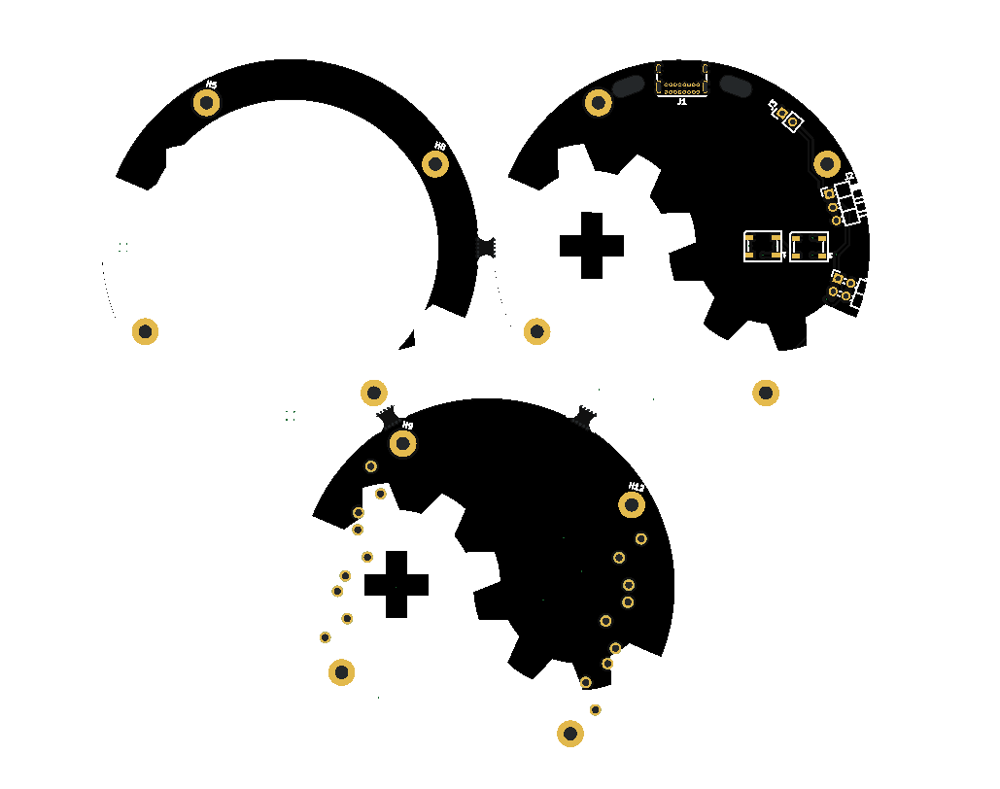

# Hackeriet Imponator / Badge
Below, you see the layout for the test version, ordered from JLCPCB:

## TODO
Lessons learned after the test version
- [ ] Remove Silkscreen text from top side. Either delete or move to bottom side.
- [ ] Add useful information to bottom side. Such as link. Or maybe also fun stuff, its free (silkscreen) real estate after all.
- [ ] Add pin 1 indicator to Shitty Add-on header.
- [x] Add 2 step toggle switch to switch between external battery and USB C.
- [x] Consider adding button(s). And/or encoder.
    - Added two buttons.
- [ ] Add numbering to UPDI programming header.
- [ ] Add github link.
- [x] Add LED for SoC, so we can run blinky.
    - Wont do, no pin real estate.
- [x] If keeping USB LED, add footprint for resistor in series. Also make it so that the USB LED is off by default and only blinks during transfer.
    - Removed USB LED.
- [x] Fix MINUS LEDs.
    - [x] Split LEDs to two different pins, so brightness can be controlled individually.
        - Will not do, cause we now use acryllic instead, so brightness should be the same.
    - [x] Minus LEDs should use diffused LEDs,
        - Did not choose this method
    - [ ] or add a Diffuser acryllic as minus with sideways LED. Press-fitted in hole in the PCB.
- [x] Add accelerometer or similar
- [X] Swap ring out for sideways LEDS. WS2812B-4020.
    - Added more LEDs also.
- [ ] Double check all components to see if we need an LDO.
- [x] Remove backplate for batteries. Instead use battery box with possible 3d printed holder.
    - Will make 3d printed holder when needed later.
- [x] Add LDO.
    - Hopefully not needed for full device, as 3xAAA goes down to ca 3.2, and LEDs probably just get a bit dimmer at that point.
    - Added LDO for accelerometer.
