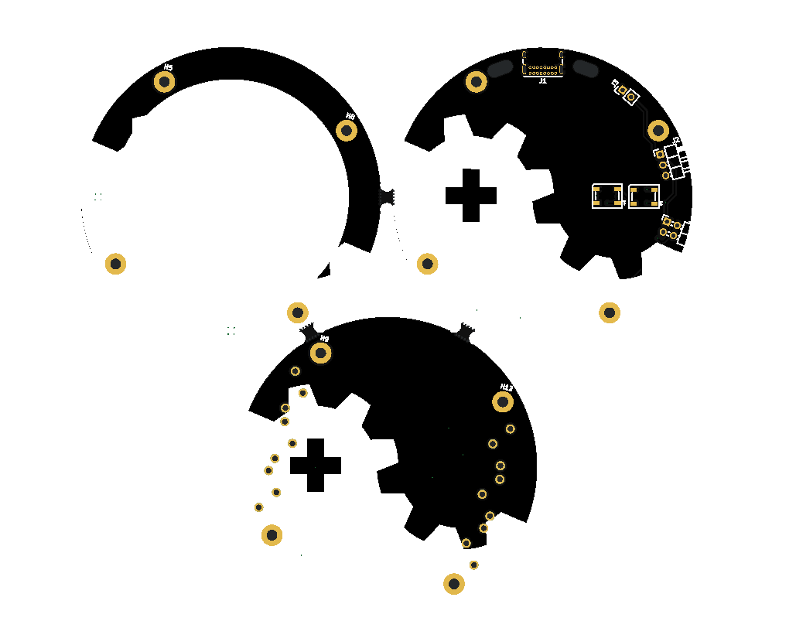

# Hackeriet Imponator / Badge
Below, you see the layout for the test version, ordered from JLCPCB:

## Distrubutors
When I made these, parts were bought from Digikey or Aliexpress. The PCBs were ordered from JLCPCB. 

## Read the Documentation
The MCU, sensor and USB to UART chip all have datasheets. I recommend having a look at these datasheets.

## Design
To understand the design of this, first open the file "hackeriet_imponator_schematics.pdf". This is the schematic for the PCB. As you can see the design has 6 different sections. The following sub-sections will explain each.

### MCU 
The MCU is the brain of the badge. An MCU is pretty much the same as a CPU, but smaller. For this board, we use the ATtiny804 by Microchip. As a comparison, the Ardino uses the ATmega328P. The name ATtiny804 is put together as such: 

- ATtiny: the name of the MCU family.
- 8: The MCU has 8KB of memory.
- 0: Its the 0-vesion of the ATtiny family.
- 4: Correlates to the pin count. The ATtiny804 has 14 pins.

The MCU has a 100nF capacitor between VCC and GND. This is quite standard for MCUs and sensors, but to be sure, check the datasheet.

There is also two buttons connected to pins, which the user can choose to use as they see fit. 

The UPDI pin is used for flashing the MCU. UDPI is an AVR specific protocol. With this you need just the UPDI pins,and the PCB of course needs to be powered at the same time.

The plan is to program a bootloader on the board once, and then firmware can be pushed over USB.

### RGB LEDs
The RGB LEDs are the WS2812B-4020. They are sideways programmable RGB LEDs, which are aimed into an acryllic plate that will be mounted on top of the PCB. These have four pins. VCC and GND to power the LEDs. Then DIN which is the signal into the LED and DOUT that is the signal out. With this, you can connect multiple LEDs in series, whcih lets you control multiple LEDs with only one pin.

### USB to UART
The MCU does not have USB built-in. Therefore we add a USB to UART converter chip to allow for logging and a bootloader. We use the MCP2221A. This behaves as a bridge between the USB and the MCU, translating USB signals to UART and vice versa. The ATtiny804 only supports UART on specific pins, so the pins for this was decided based on the ATtiny804 datasheet. 
The 5.1k resistors on the CC lines of the USB-C tells the charger/PC connected to the badge that it should deliver 5V over the USB. The 10k resistor on the resistor line is a Pull-Up resistor, as the reset line is active low. 10k is normal for Pull-up resistors. Other passive components come from the datasheet of the MCP2221A.

### Sensor (optional)
The sensor is the MPU-6050. This is an 3-axis gyroscope, 3-axis accelerometer and more. It is connetced to the MCU over the serial protocol I2C. The sensor is not needed for the badge to work, but makes it possible to do some cool stuff with the badge. The downside is that it requires extra parts and is harder to solder than the rest of the badge. The MPU-6050 also runs on a different voltage than the ATtiny. Therefore we use an LDO to convert the power down from 5V to 3.3V. Also, we use transistors as a logic level converter for the I2C bus.

### Power
The badge is powered by either via the USB port or by the battery connector. Tha battery connector is intended for connecting a battery to it. SW1 is used to toggle between battery in via the USB port or via the battery connector. This is to avoid issues if someone connect the battery and the USB at the same time. This means that the switch has to be soldered on for the badge to function correctly.  
Note: Switches are notorious for breaking. In which case it is possible to power the badge via the Shitty Add-on port as a hack.

### Connector
The badge has one external connector, which complies to the Shitty Add-On version one.

## TODO
We will have a soldering course soon. Here is a list of what needs to be prepared

- [ ] Get 30x diffusers, both MINUS end BODY
    - [ ] Decide diffuser adhesive design
    - [ ] Purchase acryllic
- [ ] Count parts we have, and order outstanding
    - [x] USBs
    - [x] Attinys
    - [x] MCP (USB-UART)
    - [ ] Resistors
    - [ ] Capacitors
    - [x] LEDs
    - [x] Buttons
    - [x] Switches
    - [x] Accelerometer
    - [x] LDO
    - [x] Transistors
- [x] Order PCBs
- [x] Receoive PCBs
- [ ] Pre-solder LEDs
- [ ] Safety-goggles
- [ ] Fans with carbon filters
- [ ] Write documentation
- [ ] Bring soldering irons
